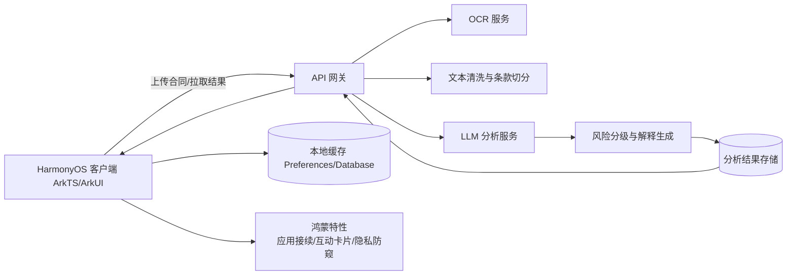
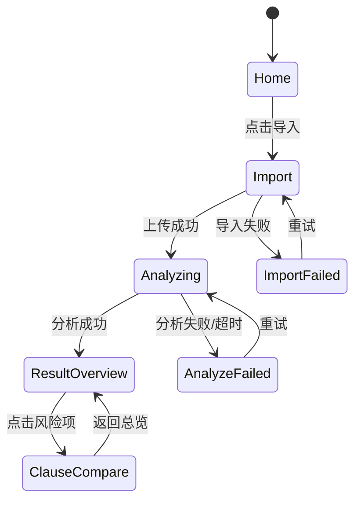

# 《法言白话》完工工程架构蓝图（准备阶段 Code Plan）

## 1. 文档目的

本文档面向“项目准备阶段”，目标是提前确定完工后的工程形态与实施路径。  
你可以把它当成“施工图”：从目录结构、模块职责、数据模型、接口协议到分阶段开发计划，都在这里固定下来。

---

## 2. 项目目标与边界（首版）

### 2.1 核心价值
- 面向非法律专业用户，提供合同的白话解读、风险提示和签署前摘要。
- 把“看不懂、不敢签”的合同阅读成本，降到“几分钟看懂重点”。

### 2.2 主链路（必须跑通）
- 导入合同（拍照/图片/文档）
- 分析中反馈（可见进度、可重试）
- 结果总览（摘要 + 风险分级）
- 对照阅读（原文 - 白话 - 风险原因）
- 多设备接续查看（手机 -> 平板/PC）

### 2.3 首版不做
- 电子签署
- 律师咨询
- 合同改写
- 多人协作
- 法律意见书导出

---

## 3. 完工后的总体架构



架构原则：
- 客户端专注交互、状态管理、系统能力接入。
- 服务端专注“识别 + 理解 + 结构化输出”。
- 输出统一 JSON 数据模型，保证不同页面展示一致。

---

## 4. 客户端完工工程目录（目标态）

> 基于 DevEco Studio Empty Ability 模板增量演进。

```text
entry/src/main/ets/
├── app/
│   ├── EntryAbility.ets
│   └── AppRouter.ets
├── pages/
│   ├── HomePage.ets                 # 首页：最近记录 + 导入入口
│   ├── ImportPage.ets               # 导入页：拍照/图片/文档
│   ├── AnalyzingPage.ets            # 分析中：进度与重试
│   ├── ResultOverviewPage.ets       # 结果总览：摘要 + 风险列表
│   ├── ClauseComparePage.ets        # 对照阅读：原文/白话/风险原因
│   └── SettingsPage.ets             # 设置：隐私开关、日志开关
├── components/
│   ├── RiskBadge.ets                # 红黄绿风险标签
│   ├── SummaryCard.ets              # 摘要卡片
│   ├── ClauseBlock.ets              # 条款块（原文+解释）
│   ├── AnalyzeProgress.ets          # 分析状态组件
│   └── EmptyState.ets               # 空态与错误态
├── services/
│   ├── api/
│   │   ├── HttpClient.ets
│   │   ├── ContractApi.ets
│   │   └── DTOMapper.ets
│   ├── ability/
│   │   ├── ContinueService.ets      # 应用接续
│   │   ├── CardService.ets          # 互动卡片
│   │   └── PrivacyGuardService.ets  # 隐私防窥
│   ├── storage/
│   │   ├── CacheService.ets
│   │   └── SessionStore.ets
│   └── parser/
│       └── FileImportService.ets    # 文件类型识别、预处理
├── model/
│   ├── domain/
│   │   ├── Contract.ets
│   │   ├── ClauseRisk.ets
│   │   └── AnalysisResult.ets
│   ├── enums/
│   │   ├── RiskLevel.ets
│   │   └── AnalyzeStatus.ets
│   └── viewmodel/
│       ├── HomeVM.ets
│       ├── ImportVM.ets
│       ├── AnalyzeVM.ets
│       └── ResultVM.ets
└── common/
    ├── constants.ets
    ├── errors.ets
    └── logger.ets
```

---

## 5. 服务端完工工程目录（建议态）

```text
server/
├── api/
│   ├── routes/
│   │   ├── upload.ts
│   │   ├── taskStatus.ts
│   │   └── analysisResult.ts
│   ├── controllers/
│   └── middleware/
├── core/
│   ├── ocr/
│   ├── cleaner/
│   ├── clause-splitter/
│   ├── llm/
│   ├── risk-engine/
│   └── summarizer/
├── repository/
│   ├── analysisTaskRepo.ts
│   └── resultRepo.ts
├── schemas/
│   ├── request.schema.ts
│   └── response.schema.ts
├── config/
└── tests/
```

说明：  
比赛可先做“轻后端”版本（单服务），后续再拆分微服务，不影响客户端接口。

---

## 6. 关键数据模型（统一契约）

```ts
export type RiskLevel = 'RED' | 'YELLOW' | 'GREEN'

export interface ClauseRisk {
  clauseId: string
  title: string
  originalText: string
  plainText: string
  riskLevel: RiskLevel
  riskReason: string
  suggestion?: string
  anchors: { page?: number; paragraph?: number }
}

export interface AnalysisResult {
  taskId: string
  contractName: string
  overallSummary: string
  signBeforeChecklist: string[]
  riskStats: { red: number; yellow: number; green: number }
  clauses: ClauseRisk[]
  generatedAt: string
}
```

---

## 7. API 协议（首版固定）

### 7.1 上传并创建分析任务
- `POST /v1/contracts/analyze`
- 入参：文件流 + 文件类型 + 可选业务标签
- 出参：`taskId`

### 7.2 查询任务状态
- `GET /v1/tasks/{taskId}/status`
- 出参：`PENDING | OCR_RUNNING | LLM_RUNNING | SUCCESS | FAILED`

### 7.3 获取分析结果
- `GET /v1/tasks/{taskId}/result`
- 出参：`AnalysisResult`

### 7.4 错误码约定
- `IMPORT_001` 文件格式不支持
- `OCR_001` 识别失败
- `LLM_001` 分析超时
- `RESULT_001` 结果不完整
- `SYS_500` 系统异常

---

## 8. 页面状态流转图



---

## 9. 鸿蒙特性接入设计（至少 3 项）

### 9.1 应用接续（必做）
- 场景：手机上分析，平板/PC 继续看结果。
- 落点：`ContinueService.ets` + `EntryAbility` 生命周期。

### 9.2 互动卡片（必做）
- 场景：桌面显示“最近合同风险摘要”。
- 落点：`CardService.ets`，点击卡片跳转 `ResultOverviewPage`。

### 9.3 隐私防窥（必做）
- 场景：公共场所查看合同，降低屏幕泄露风险。
- 落点：`PrivacyGuardService.ets` + 设置页开关。

### 9.4 多窗对照阅读（可选加分）
- 场景：大屏同时看原文与白话解释。
- 落点：`ClauseComparePage.ets` 布局扩展。

---

## 10. 准备阶段 Code Plan（按周拆解）

## 阶段 A：工程起步（第 1 周）
- 基于 Empty Ability 模板创建工程并跑通。
- 建立目录骨架：`pages/components/services/model/common`。
- 首页增加“导入合同”入口，打通路由。
- 定义基础类型：`RiskLevel`、`AnalyzeStatus`、`AnalysisResult`。

交付物：
- 可运行壳工程
- 目录结构与空实现
- 第一版数据契约

## 阶段 B：主链路闭环（第 2-3 周）
- 实现导入页、分析页、结果总览页、对照阅读页。
- 接入 `ContractApi`：上传、轮询状态、拉取结果。
- 完成失败回退和重试逻辑。
- 本地缓存最近 5 条分析记录。

交付物：
- 主链路可演示版本
- 异常路径可见（失败提示 + 重试）

## 阶段 C：鸿蒙特性集成（第 4 周）
- 应用接续接入并联调（手机 -> 平板/PC）。
- 桌面互动卡片接入并支持深链跳转。
- 隐私防窥能力接入并提供设置开关。

交付物：
- 三项鸿蒙特性可现场演示

## 阶段 D：答辩强化与稳定性（第 5 周）
- 打磨视觉一致性与交互反馈（加载、错误、空态）。
- 准备高风险/低风险两份样例合同。
- 完成弱网、超时、服务降级演示脚本。
- 补充最小测试集与日志排障信息。

交付物：
- 3 分钟稳定答辩版本
- 演示脚本 + 风险预案

---

## 11. 测试与验收清单（完工定义 DoD）

- 主链路 100% 可走通：导入 -> 分析 -> 总览 -> 对照阅读。
- 失败场景可恢复：导入失败、OCR 失败、LLM 超时。
- 风险结果可解释：每条风险都能定位原文并给出原因。
- 三项鸿蒙特性现场可演示且有明显感知。
- 核心页面首屏响应与交互时延满足答辩可接受体验。

---

## 12. 角色分工建议

- 客户端（2 人）：页面 + 状态管理 + 鸿蒙能力接入 + 缓存。
- 服务端（1-2 人）：OCR/清洗/条款切分/LLM 编排/结果结构化。
- 产品与演示（1 人可兼任）：样例合同、讲解脚本、评审问答准备。

---

## 13. 一句话落地指令

先按“统一数据契约 + 主链路闭环 + 三项鸿蒙特性”的顺序开发，不提前做二期能力。  
只要这份蓝图 80% 落地，评审现场就能快速看懂“架构完整、实现可行、特色明确”。
